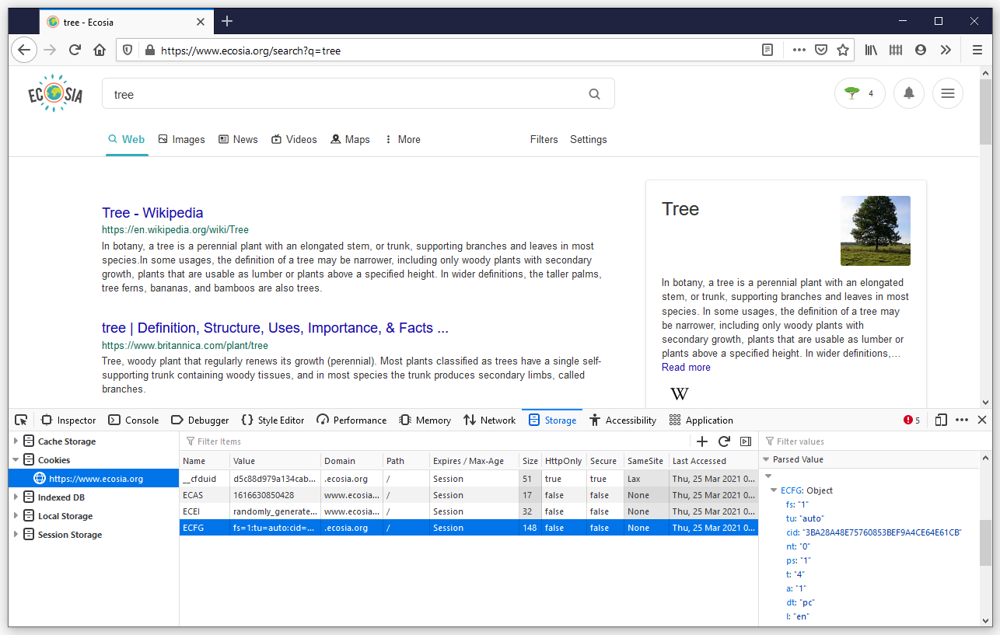
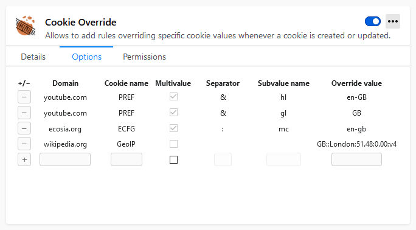

## How to configure Cookie Override

### 1. Find the cookie you want to modify
Go to the webpage where you want to use Cookie Override and open the Storage
Inspector (Shift+F9 in Firefox). Find the name and value format of the cookie
storing the information to be forced.

NB: Some cookies store a single value and some may store multiple key-value
pairs in a format like `key1=value1;key2=value2`. Cookie Override supports both
formats and allows to specify the separator and key in case of multivalue
cookies.

### 2. Add entry in the extension settings panel
Go to the extension manager (about:addons) and navigate to the options panel of
Cookie Override. Enter the desired override options into the row with empty
fields and click the "+" button.

Navigate back to the page of interest and
observe the result. The override can be verified using the Storage Inspector -
make sure to refresh the inspector window.
